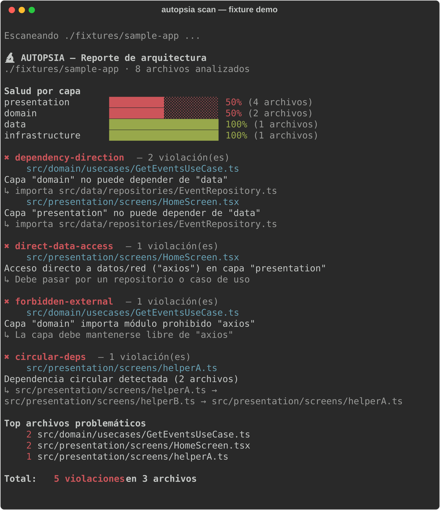
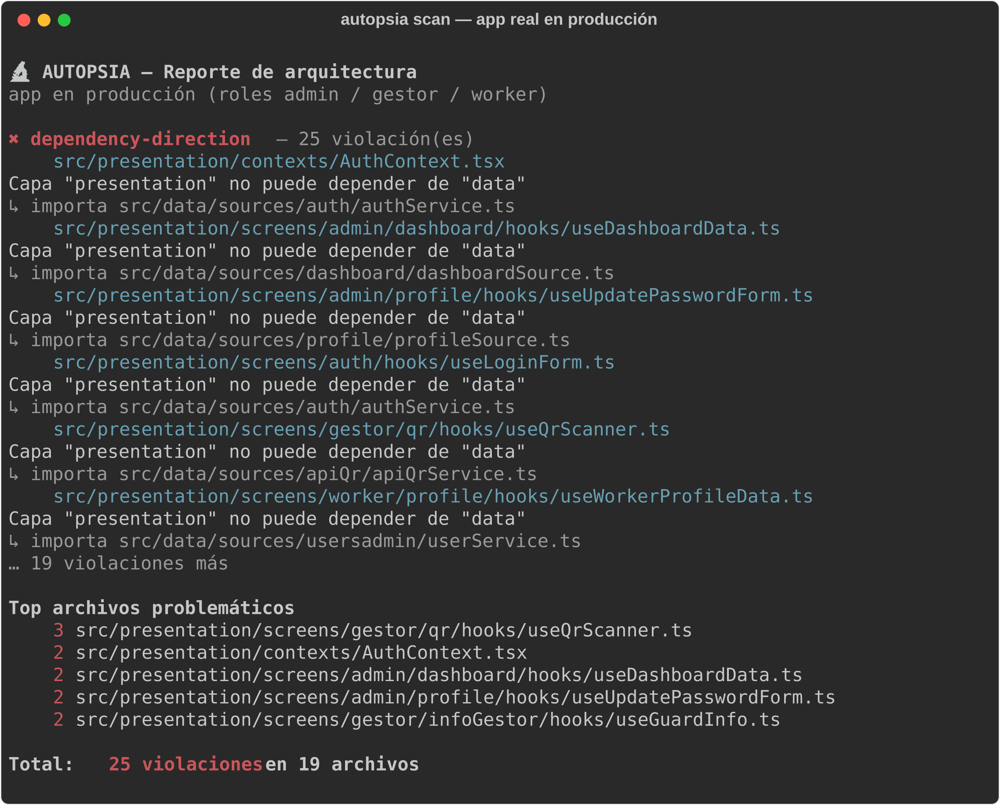

# 🔬 Autopsia

[](https://github.com/SanBenito12/Autopsia/actions/workflows/ci.yml)
[](https://www.npmjs.com/package/autopsia-rn)


**🇺🇸 [Read in English](README.md)**

CLI que audita tu proyecto **React Native / TypeScript** contra las reglas de **Clean Architecture** — encuentra los imports que rompen tus capas, en segundos.



## ¿Por qué?

Alguien mete una pantalla que llama `axios.get()` directo. Funciona, y todos siguen con su vida. Seis meses después no puedes testear esa pantalla sin mockear la red, y cuando la API cambia terminas cazando el cambio en 40 archivos de UI en vez de en un repositorio. Autopsia atrapa ese import el día que aparece — como ESLint, pero para tu arquitectura en vez de tu sintaxis.

*¿Clean Architecture te suena vagamente? Hay una [explicación de 10 líneas con diagrama](docs/getting-started.md#what-is-clean-architecture) en la guía — la versión corta: la UI no debería hablar con la red directamente, y tu lógica de negocio no debería saber que React existe.*

## Quick Start

Tres comandos, sin instalar nada:

```bash
npx autopsia-rn init          # 1. detecta tus capas y genera autopsia.config.json
npx autopsia-rn scan .        # 2. audita el proyecto
npx autopsia-rn scan . --html --open   # 3. abre el grafo interactivo de dependencias
```

Lo que vas a ver:

```
  🔬 AUTOPSIA — Reporte de arquitectura
  . · 8 archivos analizados

  Salud por capa
  presentation     ██████████░░░░░░░░░░ 50% (4 archivos)
  domain           ██████████░░░░░░░░░░ 50% (2 archivos)

  ✖ direct-data-access — 1 violación(es)
    src/presentation/screens/HomeScreen.tsx
      Acceso directo a datos/red ("axios") en capa "presentation"
      ↳ Debe pasar por un repositorio o caso de uso

  Total: 5 violaciones en 3 archivos
```

Si `init` no reconoce tu estructura de carpetas, genera un config de ejemplo — ajustarlo toma un minuto con la [guía de configuración](docs/configuration.md).

## ¿Ya tienes un proyecto con violaciones? (todos los tienen)

No tienes que arreglar 25 violaciones antes de adoptar la herramienta. Registra lo que existe hoy como **baseline**; a partir de ahí solo fallan las violaciones **nuevas**:

```bash
npx autopsia-rn scan . --update-baseline   # tolera todo lo que existe hoy
npx autopsia-rn scan . --ci                # ✅ pasa — solo fallará con violaciones NUEVAS
```

Commitea `autopsia-baseline.json` y tu deuda legacy deja de gritarte mientras la pagas. Detalles en la [guía de inicio](docs/getting-started.md#adopting-autopsia-in-a-legacy-project).

## Grafo interactivo

`--html --open` genera un visor autocontenido: grafo force-directed de dependencias, un color por capa, aristas rojas para los imports que violan reglas.

🔗 **[Demo en vivo](https://sanbenito12.github.io/Autopsia/report.html)** · [sitio de docs](https://sanbenito12.github.io/Autopsia/)

## Reglas

| Regla | Qué detecta |
|---|---|
| [`dependency-direction`](docs/rules.md#dependency-direction) | Una capa importando de una capa prohibida (ej. `domain → data`) |
| [`direct-data-access`](docs/rules.md#direct-data-access) | Pantallas/UI llamando axios, Supabase, AsyncStorage directamente |
| [`forbidden-external`](docs/rules.md#forbidden-external) | Domain contaminado con React, react-native, axios, … |
| [`circular-deps`](docs/rules.md#circular-deps) | Ciclos de imports (A → B → A), directos o transitivos |

Cada regla se puede poner en `"error"`, `"warning"` u `"off"` por proyecto, y cualquier violación puntual se puede suprimir con un comentario documentado `// autopsia-ignore-next-line`. La [guía de reglas](docs/rules.md) muestra el código malo, el fix y por qué importa — para cada regla.

## CI

Romper el build solo con violaciones nuevas:

```yaml
steps:
  - uses: actions/checkout@v4
  - uses: actions/setup-node@v4
    with: { node-version: 20 }
  - run: npx autopsia-rn scan . --ci
```

Receta completa (con baseline): [docs/ci.md](docs/ci.md).

## Probado en una app real en producción

Escaneé una app React Native en producción (~130 archivos): **25 violaciones en menos de 2 segundos, cero falsos positivos**. 3 archivos concentraban ~50% de las violaciones — el reporte funciona como plan de refactor priorizado.



## Documentación

- 📖 [Getting started](docs/getting-started.md) — paso a paso con salida real, más una intro exprés a Clean Architecture
- 📏 [Reglas](docs/rules.md) — ejemplo malo, ejemplo bueno y cómo ignorar cada regla con razón legítima
- ⚙️ [Configuración](docs/configuration.md) — cada campo de `autopsia.config.json`
- 🤖 [CI](docs/ci.md) — receta de GitHub Actions con baseline

## Roadmap

- [x] Visor interactivo del grafo (`--html --open`)
- [x] Path aliases del tsconfig (`@/*`) resueltos en el grafo
- [x] `autopsia init` — generador de config detectando tu estructura
- [x] Baseline para proyectos legacy (`--update-baseline`)
- [x] Comentarios de escape `autopsia-ignore`
- [x] Severidad por regla (`error` / `warning` / `off`)
- [ ] Comparación histórica (`--compare reporte-anterior.json`)
- [ ] Reglas extra: god files, lógica de negocio en componentes, archivos huérfanos

## Stack

Node · TypeScript · ts-morph (AST) · commander · chalk

## Licencia

MIT
